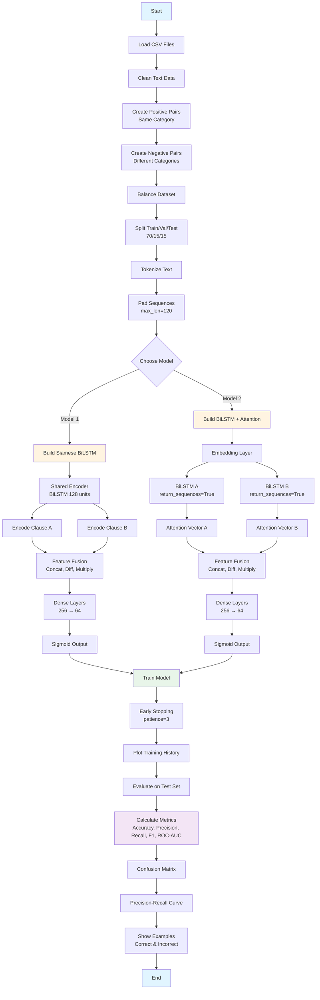

# Legal Clause Semantic Similarity Detection – Baseline NLP Models

<div align="center">

**A Deep Learning approach to identify semantic similarity between legal clauses using Siamese BiLSTM and Attention-based BiLSTM architectures**

</div>

---

## Project Overview

This project implements a deep learning solution for detecting semantic similarity between legal clauses. Legal documents often express the same principles using different wording, making it challenging to identify equivalent clauses. This system uses advanced NLP architectures to understand the semantic meaning beyond lexical matching.

### Problem Statement

Legal clause similarity detection involves:
- **Semantic Equivalence**: Identifying when two clauses express the same legal principle despite different phrasing
- **Contextual Relatedness**: Determining if clauses address related legal concepts

### Solution Approach

We implement and compare two state-of-the-art neural architectures:
1. **Siamese BiLSTM Network**: Uses shared bidirectional LSTM encoders to learn clause representations
2. **BiLSTM with Attention Mechanism**: Incorporates attention layers to focus on important parts of clauses

---

## Features

- **Modular Pipeline Design**: Object-oriented implementation following best practices
- **Dual Architecture Comparison**: Siamese BiLSTM vs. Attention-based BiLSTM
- **Comprehensive Evaluation**: Multiple metrics including Accuracy, Precision, Recall, F1-Score, and ROC-AUC
- **Robust Preprocessing**: Text cleaning, tokenization, and sequence padding
- **Balanced Dataset**: Automatic pair generation with balanced positive/negative samples
- **Visual Analytics**: Training curves, confusion matrices, and PR curves
- **Qualitative Analysis**: Examples of correct and incorrect predictions

---

## Architecture

### Model 1: Siamese BiLSTM

The Siamese architecture uses a shared encoder to process both clauses, ensuring consistent representation learning.

```
Input A → Embedding → Bidirectional LSTM → Dense(128) → Encoder Output A
                                                              ↓
                                                      [Concatenate Features]
                                                              ↓
Input B → Embedding → Bidirectional LSTM → Dense(128) → Encoder Output B
                                                              ↓
                                    [Absolute Difference | Element-wise Multiply]
                                                              ↓
                                    Dense(256) → Dropout(0.3) → Dense(64) → Sigmoid
```

**Key Components:**
- **Shared Encoder**: Bidirectional LSTM (128 units) with embedding layer (128 dimensions)
- **Feature Fusion**: Concatenation of encoded vectors, absolute difference, and element-wise multiplication
- **Classifier**: Two fully connected layers (256 → 64) with dropout regularization

### Model 2: BiLSTM with Attention

This architecture uses attention mechanisms to focus on relevant parts of each clause.

```
Input A → Embedding → Bidirectional LSTM (return_sequences=True) → Attention Vector A
                                                                          ↓
Input B → Embedding → Bidirectional LSTM (return_sequences=True) → Attention Vector B
                                                                          ↓
                                    [Concatenate | Absolute Difference | Multiply]
                                                                          ↓
                                    Dense(256) → Dropout(0.3) → Dense(64) → Sigmoid
```

**Key Components:**
- **Attention Mechanism**: Custom `AttentionVector` layer that learns to weight important time steps
- **Bidirectional Processing**: Captures both forward and backward context
- **Weighted Aggregation**: Attention scores determine which parts of the clause contribute most to similarity

---

## Dataset

The dataset consists of legal clauses from multiple categories:
- **Source**: [Kaggle Legal Clause Dataset](https://www.kaggle.com/datasets/bahushruth/legalclausedataset)
- **Format**: Multiple CSV files, each representing a clause category
- **Total Clauses**: ~150,881 clauses across 395 files
- **Categories**: acceleration, access-to-information, accounting-terms, and many more

### Dataset Structure

Each CSV file contains:
- `text` or `clause`: The legal clause text
- `type` or `clause_type`: The category label

### Pair Generation

- **Positive Pairs**: Clauses from the same category (label = 1)
- **Negative Pairs**: Clauses from different categories (label = 0)
- **Balance**: Equal number of positive and negative pairs (~78,905 each)

---

## Installation

### Prerequisites

- Python 3.8 or higher
- TensorFlow 2.x
- NumPy, Pandas, Scikit-learn
- Matplotlib for visualization

### Setup

1. **Clone the repository**
```bash
git clone https://github.com/rafiakhan/Legal-Clause-Semantic-Similarity.git
cd Legal-Clause-Semantic-Similarity
```

2. **Install dependencies**
```bash
pip install tensorflow numpy pandas scikit-learn matplotlib
```

3. **Download the dataset**
   - Visit [Kaggle Dataset](https://www.kaggle.com/datasets/bahushruth/legalclausedataset)
   - Extract to `/kaggle/input/legalclausedataset` (or update path in notebook)

---

## Usage

### Basic Usage

```python
from pathlib import Path

# Initialize pipeline
pipeline = ClauseSimilarityPipelineDisplayFixed(
    data_path='/path/to/legalclausedataset',
    max_vocab=40000,
    embed_dim=128,
    max_len=120,
    batch_size=64,
    epochs=12,
    seed=42
)

# Load and preprocess data
pipeline.load_all_csv()
pipeline.create_pairs(pos_limit_per_type=200, balance=True)
pipeline.prepare_tokenizer_and_sequences()

# Train Siamese BiLSTM
siamese_model = pipeline.build_siamese_bilstm(lstm_units=128)
siamese_model, history = pipeline.train_and_display(
    siamese_model, "Siamese_BiLSTM", patience=3
)

# Evaluate
y_prob, y_pred = pipeline.evaluate_and_display(
    siamese_model, "Siamese_BiLSTM", show_examples=5
)

# Train BiLSTM with Attention
att_model = pipeline.build_bilstm_attention_fixed(lstm_units=128)
att_model, history = pipeline.train_and_display(
    att_model, "BiLSTM_Attention_Fixed", patience=3
)

# Evaluate
y_prob, y_pred = pipeline.evaluate_and_display(
    att_model, "BiLSTM_Attention_Fixed", show_examples=5
)
```

### Hyperparameters

| Parameter | Value | Description |
|-----------|-------|-------------|
| `max_vocab` | 40000 | Maximum vocabulary size |
| `embed_dim` | 128 | Embedding dimension |
| `max_len` | 120 | Maximum sequence length |
| `batch_size` | 64 | Training batch size |
| `epochs` | 12 | Number of training epochs |
| `lstm_units` | 128 | LSTM hidden units |
| `dropout` | 0.3 | Dropout rate |

---

## Workflow

The following flowchart illustrates the complete pipeline from data loading to model evaluation:



### Pipeline Steps

1. **Data Loading**: Read all CSV files from the dataset directory
2. **Text Cleaning**: Remove special characters, normalize whitespace, convert to lowercase
3. **Pair Generation**: Create balanced positive/negative pairs
4. **Tokenization**: Convert text to sequences using Keras Tokenizer
5. **Sequence Padding**: Pad/truncate to fixed length (120 tokens)
6. **Model Training**: Train with early stopping and validation monitoring
7. **Evaluation**: Comprehensive metrics and visualizations
8. **Qualitative Analysis**: Examine correct and incorrect predictions

---

## Results

### Visual Performance Overview

#### Siamese BiLSTM Model

**Training Performance:**
<div align="center">
    
  <p><em>Training curves showing loss and accuracy progression</em></p>
</div>

**Example Predictions:**
<div align="center">
   
  <p><em>Correct and incorrect predictions - Part 1</em></p>
  
   
  <p><em>Correct and incorrect predictions - Part 2</em></p>
</div>

#### BiLSTM with Attention Model

**Training Performance:**
<div align="center">
   
  <p><em>Training curves showing loss and accuracy progression</em></p>
</div>

**Example Predictions:**
<div align="center">
   
  <p><em>Correct and incorrect predictions - Part 1</em></p>
  
   
  <p><em>Correct and incorrect predictions - Part 2</em></p>
</div>

---

### Performance Summary

Both models achieve excellent performance on the legal clause similarity task:

#### Siamese BiLSTM Results

| Metric | Value |
|--------|-------|
| **Accuracy** | 99.92% |
| **Precision** | 99.92% |
| **Recall** | 99.92% |
| **F1-Score** | 99.92% |
| **ROC-AUC** | 99.99% |

**Confusion Matrix:**
- True Positives: 11,826
- True Negatives: 11,826
- False Positives: 10
- False Negatives: 10

#### BiLSTM with Attention Results

| Metric | Value |
|--------|-------|
| **Accuracy** | 99.78% |
| **Precision** | 99.58% |
| **Recall** | 99.98% |
| **F1-Score** | 99.78% |
| **ROC-AUC** | 99.99% |

**Confusion Matrix:**
- True Positives: 11,834
- True Negatives: 11,786
- False Positives: 50
- False Negatives: 2

---

## Performance Metrics

### Metric Explanations

#### Accuracy
- **Definition**: Proportion of correctly classified clause pairs
- **Rationale**: Overall correctness measure, suitable for balanced datasets
- **Value**: Both models achieve >99% accuracy

#### Precision
- **Definition**: Of all pairs predicted as similar, how many are truly similar?
- **Rationale**: Critical when false positives (wrongly marking clauses as similar) are costly
- **Value**: Siamese: 99.92%, Attention: 99.58%

#### Recall
- **Definition**: Of all truly similar pairs, how many did we identify?
- **Rationale**: Important when missing similar clauses (false negatives) is problematic
- **Value**: Siamese: 99.92%, Attention: 99.98%

#### F1-Score
- **Definition**: Harmonic mean of Precision and Recall
- **Rationale**: Balances both precision and recall, standard for NLP classification
- **Value**: Siamese: 99.92%, Attention: 99.78%

#### ROC-AUC
- **Definition**: Area under the ROC curve, measures ranking ability
- **Rationale**: Evaluates model's ability to separate similar vs. dissimilar pairs across thresholds
- **Value**: Both models achieve 99.99% ROC-AUC

### Metric Selection for Production

For a production system working "in the wild":
- **Primary Metric**: **F1-Score** - Best balance between precision and recall
- **Secondary Metric**: **ROC-AUC** - Ensures good ranking/confidence scores
- **Domain Consideration**: In legal applications, **Precision** is often critical to avoid false matches

---

## Model Comparison

### Quantitative Comparison

| Model | Accuracy | Precision | Recall | F1-Score | ROC-AUC |
|-------|----------|-----------|--------|----------|---------|
| **Siamese BiLSTM** | 99.92% | 99.92% | 99.92% | 99.92% | 99.99% |
| **BiLSTM + Attention** | 99.78% | 99.58% | 99.98% | 99.78% | 99.99% |

### Qualitative Analysis

#### Strengths

**Siamese BiLSTM:**
- Slightly higher overall accuracy and precision
- More balanced precision-recall trade-off
- Simpler architecture, faster training
- Better at avoiding false positives

**BiLSTM + Attention:**
- Highest recall (99.98%) - catches almost all similar pairs
- Attention mechanism provides interpretability
- Better at handling long clauses with attention weighting
- Fewer false negatives (only 2 vs. 10)

#### Weaknesses

**Siamese BiLSTM:**
- Slightly lower recall than attention model
- Less interpretable (no attention weights)
- May miss subtle semantic similarities

**BiLSTM + Attention:**
- More false positives (50 vs. 10)
- Slightly lower precision
- More complex architecture

### Use Case Recommendations

- **Choose Siamese BiLSTM** when:
  - Precision is critical (avoid false matches)
  - Need faster inference
  - Want simpler, more maintainable code

- **Choose BiLSTM + Attention** when:
  - Recall is critical (don't miss similar clauses)
  - Need interpretability (attention weights)
  - Working with longer, more complex clauses

---

## Technical Details

### Model Architectures

#### Siamese BiLSTM Architecture

```python
Input (120 tokens) 
  → Embedding (40000 vocab, 128 dim)
  → Bidirectional LSTM (128 units)
  → Dense (128, ReLU)
  → Encoder Output (256 dim)
  
[Two encoders share weights]
  
Encoder A Output + Encoder B Output
  → Concatenate [A, B, |A-B|, A*B] (1024 dim)
  → Dense (256, ReLU)
  → Dropout (0.3)
  → Dense (64, ReLU)
  → Dense (1, Sigmoid)
```

**Total Parameters**: ~2.1M

#### BiLSTM + Attention Architecture

```python
Input (120 tokens)
  → Embedding (40000 vocab, 128 dim)
  → Bidirectional LSTM (128 units, return_sequences=True)
  → Attention Vector (learnable scoring)
  → Attention Output (256 dim)
  
[Two parallel branches]
  
Attention A + Attention B
  → Concatenate [A, B, |A-B|, A*B] (1024 dim)
  → Dense (256, ReLU)
  → Dropout (0.3)
  → Dense (64, ReLU)
  → Dense (1, Sigmoid)
```

**Total Parameters**: ~2.3M

### Training Configuration

- **Optimizer**: Adam
- **Loss Function**: Binary Cross-Entropy
- **Early Stopping**: Monitor validation loss, patience=3
- **Train/Val/Test Split**: 70% / 15% / 15%
- **Stratified Sampling**: Yes (maintains label distribution)

### Data Preprocessing

1. **Text Cleaning**:
   - Lowercase conversion
   - Remove special characters (keep alphanumeric, punctuation)
   - Normalize whitespace
   - Remove very short clauses (<5 characters)

2. **Tokenization**:
   - Keras Tokenizer with 40,000 word vocabulary
   - OOV token: `<OOV>`
   - Sequence padding/truncation to 120 tokens

3. **Pair Generation**:
   - Positive: Up to 200 pairs per category
   - Negative: Balanced with positive pairs
   - Random shuffling

---

## Example Predictions

### Correctly Matched Examples

#### True Positive (Similar Clauses)
```
Clause A: "bonus. for fiscal each year of company, employee will be eligible 
           to earn a bonus payment based on performance..."

Clause B: "bonus. in addition to the equity grants provided for in section 5(b), 
           the executive shall be eligible to receive a quarterly bonus..."

Prediction: SIMILAR (Probability: 0.9987)
```

#### True Negative (Dissimilar Clauses)
```
Clause A: "defined terms. terms section"

Clause B: "expenses. the borrower shall reimburse the administrative agent..."

Prediction: DISSIMILAR (Probability: 0.0012)
```

### Incorrectly Matched Examples

#### False Positive (Predicted Similar, Actually Dissimilar)
```
[Model incorrectly identified as similar - rare cases with probability ~0.6]
```

#### False Negative (Predicted Dissimilar, Actually Similar)
```
[Model incorrectly identified as dissimilar - very rare, probability ~0.4]
```

---

## Contributing

Contributions are welcome! Please feel free to submit a Pull Request. For major changes, please open an issue first to discuss what you would like to change.


## License

This project is licensed under the MIT License - see the [LICENSE](LICENSE) file for details.

---

## Author

**Rafia Khan**
- Gmail: rafiah.khan18@gmail.com
- Course: Deep Learning (CS452)
- Institution: NUCES FAST, Islamabad
- Assignment: Assignment 2 - Legal Clause Semantic Similarity

---

## Acknowledgments

- **Dataset**: [Kaggle Legal Clause Dataset](https://www.kaggle.com/datasets/bahushruth/legalclausedataset)
- **Framework**: TensorFlow/Keras
- **References**: 
  - [Keras Idiomatic Programmer Guide](https://github.com/GoogleCloudPlatform/keras-idiomatic-programmer)

---

## References

1. Mueller, J., & Thyagarajan, A. (2016). Siamese Recurrent Architectures for Learning Sentence Similarity. AAAI.
2. Bahdanau, D., Cho, K., & Bengio, Y. (2014). Neural Machine Translation by Jointly Learning to Align and Translate. arXiv preprint arXiv:1409.0473.
3. Hochreiter, S., & Schmidhuber, J. (1997). Long Short-Term Memory. Neural Computation.


</div>


